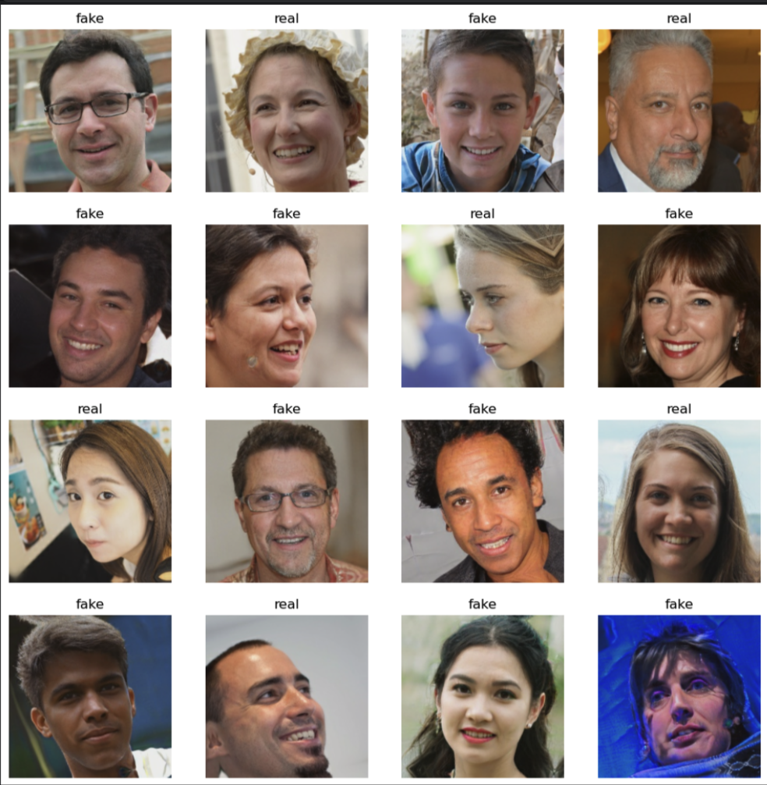
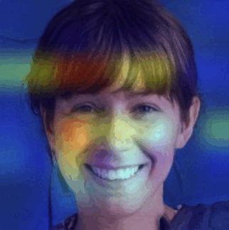
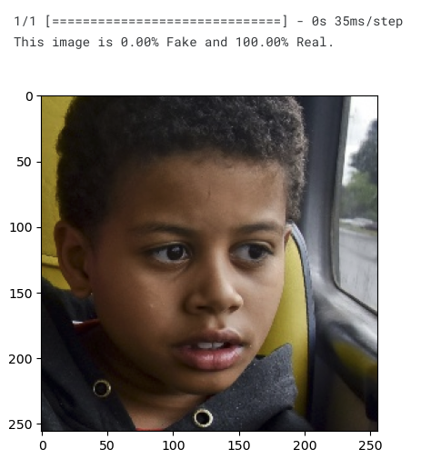
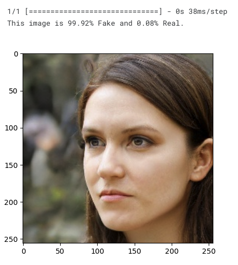
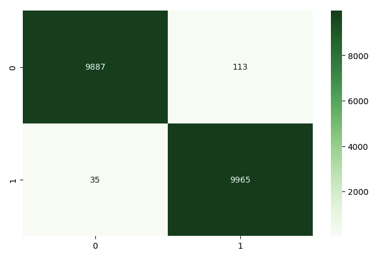

# Real vs Fake face detection with Keras

Deep Computer Vision System for the detection of real vs fake faces of people. Fake faces are been generated by StyleGAN (Generative Adversarial Networks).

In this project I created a Jupiter notebook where I analyzed the "140k Real and Fake Faces" dataset on Kaggle and I fine-tuned the DenseNet CNN model using Keras achieving a 0.99 accuracy. 

This dataset consists of all 70k REAL faces from the Flickr dataset collected by Nvidia, as well as 70k fake faces sampled from the 1 Million FAKE faces (generated by StyleGAN) that was provided by Bojan.

Find my [notebook](https://www.kaggle.com/code/nicoladisabato/fake-face-detection-with-keras-accuracy-0-97) on Kaggle.

# Grad-cam visualization
The project includes an example of the **Grad-CAM** visualization, invented by Selvaraju and coauthors, which uses the gradient of the classification score with respect to the convolutional features determined by the network in order to understand which parts of the image are most important for classification.

# Requirements

The following Python packages must be installed to run the code:
  - numpy
  - pandas
  - scikit-learn
  - tensorflow 2.x
  - keras
  - matplotlib

The code can be executed on Kaggle or Google Colab (remember to activate the GPU accelerator).

# Results
## Real face example

## Fake face example

## Confusiona Matrix
Test Loss: 0.022434

Test Accuracy: 0.99260

